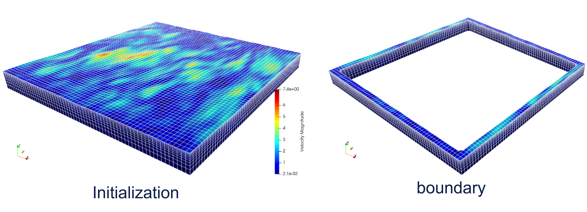

# CFDwavemaker

Wave-kinematics library for initialising CFD domains (or feeding CFD boundaries) with
consistent wave fields. It returns surface elevation, velocity, and pressure at any
point in space and time, from a range of wave theories, and is built for fast
initialisation of large domains.

<p align="center">
  
</p>
<p align="center"><em>The two ways to use CFDwavemaker: initialise the entire CFD domain with wave kinematics (left), or feed kinematics continuously at the domain boundaries (right).</em></p>

The code supports **OpenMP** (shared-memory parallelism) and, optionally, **MPI**
(distributed grid computation), and has several special features for fast
initialisation of large domains built in.

A full user manual is available as a compiled PDF, attached to the latest
[GitHub release](https://github.com/oystelan/CFDwavemaker/releases/latest)
([direct download](https://github.com/oystelan/CFDwavemaker/releases/latest/download/CFDwavemaker_manual_v3.1.0.pdf)).
The LaTeX source lives in [`CFDwavemaker_manual/`](CFDwavemaker_manual/).

## Input file

The library is configured through a single ASCII input file, always named
`waveinput.dat`, read from the working directory at `wave_Initialize()`. All
keywords and their definitions are documented in the user manual (see above).

For irregular waves, the companion tool
[**WaveForge**](https://github.com/oystelan/waveforge) provides a graphical
interface for setting up the wave spectrum and generating the `waveinput.dat`
file, with live 3-D preview of the resulting sea state:

<p align="center">
  <a href="https://github.com/oystelan/waveforge">
    
    
  </a>
</p>

## Citing

If you use CFDwavemaker in your work, please cite the
[OMAE 2022 paper](https://asmedigitalcollection.asme.org/OMAE/proceedings/OMAE2022/85925/V007T08A002/1147999):

> Lande, Ø., & Helmers, J. B. (2022). *CFDwavemaker: An Open-Source Library for
> Efficient Generation of Higher Order Wave Kinematics.* In Proceedings of the
> ASME 2022 41st International Conference on Ocean, Offshore and Arctic
> Engineering (OMAE2022), Vol. 7, V007T08A002. ASME.

```bibtex
@inproceedings{lande2022cfdwavemaker,
  title        = {CFDwavemaker: An Open-Source Library for Efficient Generation of Higher Order Wave Kinematics},
  author       = {Lande, {\O}ystein and Helmers, Jens Bloch},
  booktitle    = {International Conference on Offshore Mechanics and Arctic Engineering},
  volume       = {85925},
  pages        = {V007T08A002},
  year         = {2022},
  organization = {American Society of Mechanical Engineers}
}
```

## Supported wave theories

- **Linear** wave theory (irregular & short-crested waves)
- **Second-order** wave theory (Sharma & Dean, with Taylor expansion above z = 0) —
  irregular & short-crested waves
- **Stokes 5th-order** regular waves (long-crested)
- **Stream-function** (Fenton / Rienecker & Fenton) steady regular waves — accurate for
  steep and shallow-water waves where Stokes theory breaks down
- **Wave-maker** theory (piston-type), reading paddle motion from an input file
  (long-crested)
- **Spectral-Wave-Data (SWD)** — extension for reading higher-order spectral method
  (HOSM) kinematics via the open [SWD library](https://github.com/SpectralWaveData/spectral_wave_data)
- **VTK kinematics** — read kinematics stored in VTK (`.vts`) format from other CFD
  solvers, including multilayer Lagrangian output (per-layer thickness `h`,
  non-hydrostatic pressure `phi`)

## Outputs

- Surface elevation at any position (x, y)
- Velocity components (ux, uy, uz)
- Dynamic and non-hydrostatic pressure
- Volume fraction (for VOF initialisation)
- Seabed elevation

## Special features

- **Grid interpolation** of wave kinematics (Lagrangian stretched s-grid with 4-D cubic
  spline interpolation) for much faster initialisation when using second-order
  kinematics — far fewer expensive second-order evaluations are needed for an accurate
  field.
- **MPI-distributed grid computation**: the second-order s-grid kinematics can be
  computed collectively across MPI ranks (work-balanced column partition +
  `MPI_Allgatherv`), so every rank ends up with the full updated field. See the manual
  (section *Distributed grid computation with MPI*).

## Linking / usage

The library is called through a small `extern "C"` API (see
[`src/CFDwavemaker.h`](src/CFDwavemaker.h)): initialise once with `wave_Initialize()`
(reads `waveinput.dat` from the working directory), then query points with
`wave_VeloX/Y/Z`, `wave_SurfElev`, `wave_DynPres`, etc.

- **C / C++ / Basilisk / OpenFOAM**: link the static or shared library and include
  `CFDwavemaker.h`.
- **Python**: load the shared library with `ctypes`. A ready-to-use wrapper is provided
  in [`examples/python/cfdwavemaker.py`](examples/python/cfdwavemaker.py), and the
  manual's *Link to Python* section documents the full binding.

Worked examples for each theory live in [`examples/python/`](examples/python/).

## Build instructions

1. Navigate into the folder `src/`.
2. Run `make` — the serial version of CFDwavemaker will be built. Alternatively provide
   a specific build target:
   - `make` or `make default` — the default build (built-in kinematics library + the SWD
     extension).
   - `make basic` — the built-in kinematics library only.
   - `make all` — the complete library, including the VTK extension. This requires that
     the VTK library has been installed and compiled, and that the makefiles are updated
     for the VTK version you have installed. A bit involved to link, so stay away from
     this unless you need it.
   - `make mpi` (via `make_mpi.mk`) — the MPI build (uses `mpicxx`, `-DMPI_enable=1`;
     OpenMP is disabled in this build — it is either/or). The host CFD owns
     `MPI_Init`/`MPI_Finalize`; the library only uses the existing communicator.

## Version log (highlights only)

### Version 3.1.0
- **Stream-function (Fenton) wave theory** added (`theory_type stream`) — validated
  against Fenton's tabulated results.
- **VTK multilayer support**: read per-layer thickness (`h`) and non-hydrostatic
  pressure (`phi`) from multilayer `.vts` output, with conservative piecewise-parabolic
  (PPR) or linear vertical reconstruction (`vertical_interp`). Faster VTK interpolation.
- **MPI support**: distribute the second-order s-grid kinematics computation across MPI
  ranks (`wave_set_mpi_comm`, work-balanced partition). Serial and MPI results are
  bit-identical.
- **Python `ctypes` wrapper** and a full LaTeX user manual.
- `[wave reference point]` shift now applied consistently on the VTK path.

### Version 3.0.1
- (major update) Added spline interpolation in 4 dimensions to LSgrid. This improves
  accuracy and smoothness of the resulting time series and improves calculation time,
  since much less second-order kinematics is needed to create an accurate description of
  the field.

### Version 2.1.6
- VTK extension.
- Minor bugfixes in second-order theory related to intermediate water-depth usage.

### Version 2.1.5
- Added probes as output, so that x, y, z coordinates may be specified to dump
  kinematics to file.
- Fixed CFDwavemaker for Windows — now compiles without SWD.
- Some cleanup of the code.

### Version 2.1.4
- Improved performance with OpenMP and irregular waves.
- Minor bug fixes.
- Added parameter `[vtk output]/timelabel` and `[lsgrid]/init_only`.

### Version 2.1.3 (highlights since version 1)
- Complete restructuring of the input file format.
- Implementation of a new Lagrangian stretched-grid interpolation scheme.
- Support for spectral wave data files (`.swd`) through the external
  [Spectral-Wave-Data](https://github.com/SpectralWaveData/spectral_wave_data) library,
  enabling higher-order spectral methods for CFD initialisation and boundaries (HOSM).
- General cleanup and removal of old leftovers.
- The entire code restructured to make use of classes; the previous Stokes C code
  converted to a C++ class.
- Fixed a large number of bugs in the original code.
