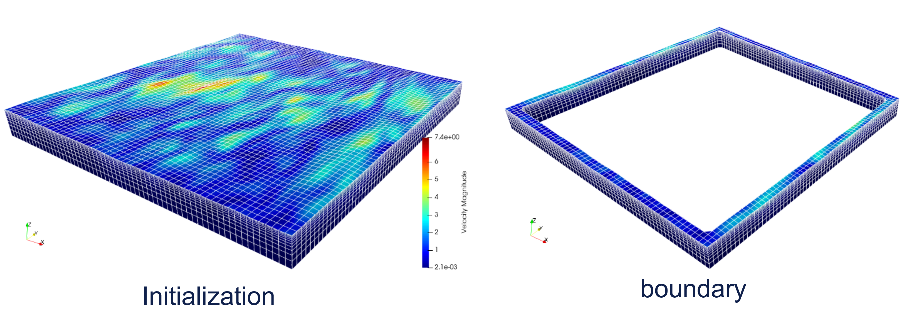

.. CFDwavemaker documentation master file

CFDwavemaker User Manual
========================

Purpose
-------

CFDwavemaker is a C++ library developed with the purpose of providing wave kinematics input to CFD codes.
Kinematics may either be generated at the boundary (similar to a traditional wave maker) or used to initialize the entire domain before startup of the simulation (or both), as illustrated in the figure below.
What distinguishes CFDwavemaker from other similar codes is its capablility of generating irregular short crested waves with several hundreds of frequency components using second order potential wave theory in a numerically efficient way. 

Reference
---------

The code is open source and free to use by anyone. If you find the code useful and decide to used it in projects or publications, make sure to reference to

.. code-block:: none

   @inproceedings{landeCFDwavemaker,
      title={CFDWAVEMAKER: An open-source library for efficient generation of higher order wave kinematics},
      author={Lande, Oystein and Helmers, Jens Bloch},
      booktitle={International Conference on Offshore Mechanics and Arctic Engineering},
      volume={57656},
      pages={V03AT02A029},
      year={2022},
      organization={American Society of Mechanical Engineers}
   }
	

.. toctree::
   :maxdepth: 3
   :numbered:
   :caption: Table of Contents:

   download
   build
   linking
   inputfile_description
   inputfile_examples
   definitions
   theory
   todolist
   license
   references

