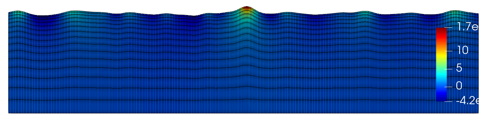

Input file format
=================

For CFDwavemaker to run, an input file containing all required data must be specified. The name of this file must be *"waveinput.dat"*, and should be located in the path of where the library or program calling CFDwavemaker is run. If this file cannot be located the program will stop and an error message will show in the standard output.

The input file system is made up of keywords and tags. Every keyword as a certain number of mandatory tags, and some which are optional. To distinguish between a keyword and a tag, square braces are used for keywords while tags are outlined in red. To be more specific:

**[This is a keyword]**

``This is a tag``

All tags belong to a keyword. The order of the keywords are almost arbitrary with one exceptions:

- It is generally wise to specified which wave type to use before specifying other keywords.

Comments are permitted in the input files using # ,which will be stripped away before reading the file. 
All tags and keywords are ALWAYS given with lower caps letters. Space is used as separator between keyword and values.

All keywords available in CFDwavemaker (and what they do) are described in sections underneath.

Version
-------

CFDwavemaker has been developed over many years of iteration where new functionalities and improvements have been added along the way. The input format introduced in versiion 2.*.* is quite different from the original input fileformat. A cleanup was neccessary and therefore the support for old input files (pre v2) have been discontinued. 
The input file has the CFDwavemaker version always defined in the first line.

Example: **@v213**

.. note::

  Please make sure to clearly specify the input file format version in the first line of the input file. if the version is not found or if the version is too old, CFDwavemaker will stop running. Older versions of CFDwavemaker (pre v2.1.3) is not recommended to use anymore.

Wave types
----------

CFDwavemaker currently support the following wave theories. Which branch of wave theory to used is controlled by the keyword **[wave type]**

1. ``irregular`` - irregular wave theory (linear or second order)
2. ``regular`` - Stokes regular wave theory (up to 5th order)
3. ``wavemaker`` - Wave maker theory
4. ``swd`` - `Spectral-Wave-Data`_ (swd) is an external library for generating  through DNVGLs HOSM wave model
5. ``vtk`` - `VTK library`_ is another external library which is supported by most CFD programs. By building and linking this with CFDwavemaker, kinematics can be imported from any program capable of writing vtk files.

.. _`Spectral-Wave-Data`: http://https://github.com/SpectralWaveData
.. _`VTK library`: http://www.vtk.org 

In general, the most effort has been put into second order irregular wave theory, which is why this library was made in the first place. More wave theories may be added in the future.

To chose one of the above use the following code word

.. code-block:: none

    [wave type]
    # WAVETYPE 
    irregular

General input data
------------------
Some data are mandatory for all wave types. These parameters are specified under the keyword **[general input data]**.

.. list-table::
    :widths: 20 70 10

    * - **name**
      - **description**
      - **mandatory**
    * - ``depth``
      - Water depth used to generate wave height
      - yes
    * - ``mtheta``
      - (mean) wave direction. In case of long-crested unidirectional waves, this input prepresents the wave direction, while for short-crested waves, this represents the mean wave direction. Value is given in degrees where a value of 0 corresponds to wave propagating along the x-axis in the positive direction.
      - yes
    * - ``swl``
      - Still water level. default value = 0.
      - no
    * - ``normalize``
      - Normalize the wave by dividing the spetral values by the spectral 0th moment. This is useful to produce focused irregular waves. Default value = 0 (False)
      - no
    * - ``amplify``
      - Used to amplify the spectral parameters. can be used to scale all amplitudes of a wave spectrum. Default value = 1.
      - no
    * - ``gravity``
      - gravity, which by default is set to 9.81 m/s^2
      - no
    * - ``rho``
      - water density, which by default is set to 1025 kg/m^3
      - no

Finally, an example:

.. code-block:: none

    [general input data]
    depth  1.2
    mtheta  0.0000 
    swl  0.     
    normalize  0
    amplify  1.

Wave reference point
--------------------

A reference point in time and space for the wave specification is needed. This is specified using the tag **[wave reference point]**, as shown in the example given below. time is given in seconds, position x and y are given in meters.
Specifying the **[wave reference point]** is optional. If this is not given, default values will be assumed.

.. list-table::
    :widths: 20 70 10

    * - **name**
      - **description**
      - **mandatory**
    * - ``time``
      - reference point in time. (default value: ``time`` = 0)
      - no
    * - ``x``
      - reference point in space, x-axis. (default value: ``x`` = 0)
      - no
    * - ``y``
      - reference point in space, y-coordinate. (default value: ``y`` = 0)
      - no

.. code-block:: none

    [wave reference point]
    # for focused waves this will correspond to the focus point in time and space
    time  15.0
    x  3.5   
    y  0.0

Ramps
-----

Ramps can sometimes be useful to avoid transient behaviour for example in at startup, or when specifying wave kinematics in corners of a domain. Ramps are specified in time and space (x and y plane only) by calling the keyword **[ramps]** followed by the ramp input. The ramp may be omitted all together, in which case no ramp of any kind is used.

.. list-table::
    :widths: 20 70 10

    * - **name**
      - **description**
      - **mandatory**
    * - ``time_rampup``
      - keyword for adding a time rampup. Three values follows. An on/off swith using the value 0 or 1, the starttime of the ramp, and the end time of the ramp. The function starts at a value of 0.0 at t <= starttime, and increases linearily towards a value of 1.0 at t >= endtime.
      - no
    * - ``time_rampdown``
      - keyword for adding a time rampdown. Three values follows. An on/off swith using the value 0 or 1, the starttime of the ramp, and the end time of the ramp. Rampdown function is the inverse of the rampup function. this function starts with a value of 1.0 at time <=starttime, and linearily goes towards 0. at endtime.
      - no
    * - ``x_rampup``
      - keyword for adding a rampup in x-direction. Three values follows. An on/off swith using the value 0 or 1, the start position of the ramp, and the end position of the ramp. The function starts at a value of 0.0 at x <= startpos, and increases linearily towards a value of 1.0 at x >= endpos.
      - no
    * - ``x_rampdown``
      - keyword for adding a rampdown in x-direction. Three values follows. An on/off swith using the value 0 or 1, the startpos of the ramp, and the end time of the ramp. Rampdown function is the inverse of the rampup function. this function starts with a value of 1.0 at x <=startpos, and linearily goes towards 0. at endpos.
      - no
    * - ``y_rampup``
      - same description as ``x_rampup``, only for y-diretion
      - no
    * - ``y_rampdown``
      - same description as ``x_rampdown``, only for y-diretion
      - no

.. code-block:: none

    [ramps]
    # rampname on/off starttime endtime
    time_rampup  1  0.0000  3.0
    time_rampdown  0  0.0000  1.0
    # rampname on/off startpos endpos   
    x_rampup  0  -11.0000  -10.0
    x_rampdown  0  11.0000  12.0
    y_rampup  0  -11.0000  -10.0
    y_rampdown  0  11.0000  12.0

Irregular wave specification
----------------------------

Irregular waves are prescribed by specifying the linear frequency components, directional components, amplitudes, etc, which consititute the irregular wave field. The second order bounded components are computed by CFDwavemaker if the **[second order]** is present in the file. 

.. note::

  In previous releases it was possible to specify irregular waves based on spectral data input (spectrum type, hs, tp, etc). This module was however never completely finished and was never used. I decided to discontinue this development since in pratice its much easier and practical to use other codes such as python, matlab or similar to generate the linear wave components and write the appropriate `waveinput.dat` file.

The tag **[irregular wave components]** needs to present. This tag requires the following information to follow:

.. list-table::
    :widths: 20 70 10

    * - **name**
      - **description**
      - **mandatory**
    * - ``nfreq``
      - number of frequency components to read from input file. A list of frequency component data should follow, where the number of entries (lines) must correspond to the number of components specified with this parameter. For each component the following data should be given on a single line, separate by space:
        **1. frequency:** given in rad/s. 
        **2. amplitude:** given in meters. 
        **3. wave number:** wave number assosiated with the frequency (specified in rad/m).
        **4. phase:** Random phase, value between 0 and 2*PI (specified in radians). 
        **5. theta:** (only specified if ``ndir``= 0) direction of frequency component (specified in radians). 
      - yes
    * - ``ndir``
      - number of directional components and the assosiated wave spreading, to read from input file. The directional components should follow directly after the list of frequency component data. ``ndir`` may be set to zero, in which case the program will look for an additional fifth column in the list of frequency components data, specifying the direction of each single frequency component.
      - yes
    

Example 1:

.. code-block:: none
    
    [irregular wave components]
    nfreq 5
    ndir 0
    # OMEGA [rad/s]    A[m]       K[rad/m]        Phase[rad]    theta[rad]
    0.80684460     0.09098686     0.06636591    22.09105101    -0.51238946
    0.57527858     0.08989138     0.03410555    -8.15520380    -1.01219701
    0.59315305     0.20143761     0.03615181    -8.35009702    -0.92729522
    0.71493207     0.09704876     0.05213889    11.00239563    -0.58800260
    0.73560378     0.15043259     0.05518335    14.76881712    -0.55165498
    
Example 2:

.. code-block:: none
    
    [irregular wave components]
    nfreq 4
    ndir 19
    # OMEGA [rad/s] A [m]     K          Phase [rad]
        5.2033     0.0369     2.7670     0.0000
        5.3014     0.0356     2.8708     0.0000
        5.3996     0.0343     2.9767     0.0000
        5.4978     0.0331     3.0849     0.0000
    # DIRS [rad]      Density 
        -0.7854       0.042843
         -0.69813     0.045853
         -0.61087     0.048652
          -0.5236     0.051192
         -0.43633     0.053426
         -0.34907     0.055313
          -0.2618     0.056819
         -0.17453     0.057916
        -0.087266     0.058583
                0     0.058806
         0.087266     0.058583
          0.17453     0.057916
           0.2618     0.056819
          0.34907     0.055313
          0.43633     0.053426
           0.5236     0.051192
          0.61087     0.048652
          0.69813     0.045853
           0.7854     0.042843

Second order wave theory
........................

By default, the waves which are generated uses linear wave theory. To switch on the use of second order wave theory (which you DO want todo for steep waves), the keyword **[second order]** must be specified, followed by some optional control parameters

.. list-table::
    :widths: 20 70 10

    * - **name**
      - **description**
      - **mandatory**
    * - ``bandwidth``
      - control the bandwidth of which frequencies that are allowed to interact in the second order sum and difference terms. For wide band spectra this is recommended. default value is "off", which implies that all frequencies are allowed to interact in the second order terms. Alternatively bandwidth=auto can be used and CFDwavemaker will approximate a reasonable bandwidth for you from the spectral moments, i.e bandwidth``=0.7*m0/m1. The third alternative is to specify a value given in rad/s.
      - no
    * - ``extmeth``
      - Choice of extrapolation method. By default a second order taylor expansion (eularian coordinate system) is used (``extmeth``= 0). A second order lagrangian implementation will be supported in the near future (extmeth = 1). 
      - no

.. code-block:: none

    [second order]
    bandwidth 0.5
    extmet 2

.. note::

  The keyword **[second order]** is only for irregular wave theory. If other theories are used, this keyword is ignored.

Stokes regular wave specification
---------------------------------

Sir George Stokes solved this nonlinear wave problem in 1847 by expanding the relevant potential flow quantities in a Taylor series around the mean (or still) surface elevation. As a result, the boundary conditions can be expressed in terms of quantities at the mean (or still) surface elevation. Stokes's regular wave theory is of direct practical use for waves on intermediate and deep water. It is used in the design of coastal and offshore structures, in order to determine the wave kinematics (free surface elevation and flow velocities). 
Several implementations of these waves exists. The implementation in CFDwavemaker is based on Ref :cite:`skjelbreia1960fifth` and goes up to 5th order.

To specify the properties of the Stokes waves the following keyword is used: **[stokes wave properties]**. The properties that follows are given in the table below.

.. list-table::
    :widths: 20 70 10

    * - **name**
      - **description**
      - **mandatory**
    * - ``wave_length``
      - Length of the stokes wave. units in meters.
      - yes
    * - ``wave_height``
      - Height of the Stokes wave, measured from through to crest (i.e. not amplitude). units in meters. 
      - yes
    * - ``order``
      - order to use for regular stokes waves. valid input is number from 1 to 5. Default is 5.
      - no
    * - ``current_speed``
      - Current speed. Current speed direction in same direction as wave propagation. units in m/s.
      - no

.. code-block:: none

   [stokes wave properties]
   #mandatory properties for stokes wave
   wave_length  300.
   wave_height  20. 
   current_speed 0.       

Wavemaker theory wave specification
-----------------------------------

Wavemaker theory may sometimes be useful when validating wave propagation against model test data were a physical wave maker has been used to generate the waves.

Piston wavemaker theory
.......................

.. _pistonwavemaker:
.. figure:: http://www.edesign.co.uk/wp-content/uploads/2013/02/IMGP3051.jpg
   :alt: Example of edinbourgh designs piston wave makers
   
   Example of `Edinbourgh Designs`_ piston wave maker

   .. _`Edinbourgh Designs`: http://www4.edesign.co.uk/product/piston-wave-generators/

A piston wave maker is a flat wall which moves horizontally, thereby generating waves (see :numref:`pistonwavemaker`). In some cases one may be so lucky to get the position of the wall as output from a wave basin tests. This position signal may be used to generate kinematics using piston wave maker theory :cite:`kennard1949generation`. 
To use piston wave maker theory **[wave type]** must first be set to *wavemaker*. Secondly, the piston wave maker input signal must be specified. This is done through **[piston wavemaker properties]**
A list of the required input is given below.

.. list-table::
    :widths: 20 70 10

    * - **name**
      - **description**
      - **mandatory**
    * - ``ntimesteps``
      - number of timesteps that the time-series that follows consists of. Three columns are required. the first is **Time**, second is **Piston horizontal amplitude** and third is **Piston horizontal velocity**. Piston hosisontal amplitude is the piston position signal (subtracting the mean). It the velocity is not available, it is recommended to use the gradient of the piston position signal
      - yes
    * - ``alpha_z``
      - Simple way of adjusting the amplitude time series. default value for this this is 0. Amplitude applied when calculating kinematics are Piston_ampl = Piston_horizontal_amplitude_time_series + alpha_z
      - no
    * - ``alpha_u``
      - Simple way of adjusting the velocity time series. default value for this this is 0. Amplitude applied when calculating kinematics are Piston_velo = Piston_horizontal_velocity_time_series + alpha_u
      - no

The time-series describing the wave maker motions shall follow directly after the input parameter as shown in the example below.

Example 1:

.. code-block:: none

  [piston wavemaker properties]
  # for piston wave maker
  # alpha values for adjusting elevation and velocity
  ntimesteps 24000
  alpha_z 0.0
  alpha_u 0.1
  # Number of lines to be read (time,amplitude,velocity)
  0.0000  0.0000942  0.0109990
  0.0025  0.0001217  0.0103278
  0.0050  0.0001458  0.0089456
  0.0075  0.0001664  0.0075024
  0.0100  0.0001833  0.0060345
  0.0125  0.0001966  0.0045800
  0.0150  0.0002062  0.0031888
  0.0175  0.0002125  0.0019247
  0.0200  0.0002159  0.0008472
  ...

Spectral wave data (SWD) specification
--------------------------------------

The Spectral-Wave-Data library is an open-source library which provides an open interface for how to exchange spectral ocean wave kinematics between computer programs. This provides a very useful extension to CFDwavemaker, which facilitates external wave theories, as long as they can write the output in the .swd format. This includes wave theories such as (but of course not limited to): 

- higher order spectral methods (HOSM) such as generated by `WAMOD`_
- Fenton-Stream waves and other regular wave theories, using the open python source code `raschii`_

.. _`WAMOD`: https://projects.dnvgl.com/sesam/status/Wamod/Wamod.html?id=WAMOD_12-DEC-2019_2&typ=new%20feature&showVersion=yes
.. _`raschii`: https://pypi.org/project/raschii/

To read swd files in CFDwavemaker, **[wave type]** = swd, and the following list of parameters can be specified under the keyword **[swd wave properties]**: 

.. list-table::
    :widths: 20 70 10

    * - **name**
      - **description**
      - **mandatory**
    * - ``swdfile``
      - Name of swd file. Obviously this is mandatory. a full path may be specified if the file is located in another directory than the  default run directory. (spaces in the file path is not permitted)
      - yes
    * - ``nsumx``
      - Number of spectral components to apply in x direction (<0: apply all)
      - no
    * - ``nsumy``
      - Number of spectral components to apply in y direction (<0: apply all)
      - no
    * - ``impl``
      - Index to determine actual derived class. 0 = Default. <0 = In-house and experimental implementations. >0 = Validated implementations available open software
      - no
    * - ``ipol``
      - Index to request actual temporal interpolation scheme. 0 = Default (C^2 continous scheme). 1 = C^1 continous. 2 = C^3 continous
      - no  
    * - ``norder``
      - Expansion order to apply in kinematics for z>0. 0 = Apply expansion order specified in swd file (default). <0 = Apply exp(kj z). >0 = Apply expansion order = norder
      - no
    * - ``dc_bias``
      - Control application of zero-frequency bias present in SWD file. false = Suppress contribution from zero frequency amplitudes (default). true  = Apply zero frequency amplitudes from SWD file.
      - no    

An example of the required input parameters which needs to be specified in *waveinput.data* is given below:

.. code-block:: none

    [swd wave properties]
    swdfile     constant/fenton_h1.2_d1_l2.swd
    # Optional SWD parameters. You probably do not need to change these. See the SWD documentation for what they mean
    nsumx -1
    nsumy -1
    impl 0
    ipol 0
    norder 0
    dc_bias false
    
*Some additional notes regarding the use of swd:*

- Water depth specified in the swd file will overrule the specified water depth given in **[general input data]** (see :numref:`inputfile_description:General input data`).
- Like irregular second order wave theory, the grid interpolation schemes presented in :numref:`inputfile_description:Grid interpolation schemes` are fully supported when using SWD. This comes very much in handy when large short crested irregular sea states from HOSM simulations are used as input.
- The default reference position of the swd simulation is x0=y0=t0=0 and the wave propagation direction is in accordance with the coordinate system definition in (see :numref:`inputfile_description:General input data`). To change reference position, see :numref:`inputfile_description:Wave reference point` and ``swl`` in :numref:`inputfile_description:General input data`.

VTK library kinematics
----------------------

The `VTK (Visialization Toolkit) library`_ is open-source and a widely used library in the CFD industry. It support a wide range of formats which covers pretty much all thinkable grid types used by CFD solvers. Compiling CFDwavemaker with this extension library therefore expands its usage, and enables CFDwavemaker to read kinematics from most wave models, as long as they can export their result into one of the hundres of formats that VTK supports.

That being said, the many formats supported in the VTK library has different functions for loading and extracting data. Hence, supporting them all implies a lot of coding. For now, the structuredXMLGrid format (.vts) is supported, which is an ideal format for storing eulerian and lagrangian mesh data on a cartisian grid. More formats, like the octree-format (.htg) or the versatile UnstructuredXML format (.vtu), will surely be implemented in the future as the need arises.

.. _`VTK (Visialization Toolkit) library`: http://www.vtk.org

The input format in the waveinput.dat file is fairly simple. First, **[wave type]** must to be set too `vtk`. The keyword for providing additional required vtk properties is specified under the keyword **[vtk input]**. The following list of properties shall/may be specified

.. list-table::
    :widths: 20 70 10

    * - **name**
      - **description**
      - **mandatory**
    * - ``storage_path``
      - Absolute or relative path to the folder containing the .vts files.
      - yes
    * - ``filename``
      - string containing reoccuring characters in all vtk files. These may typically be named sim0000.vts, sim0001.vts, sim0002.vts, etc... then you can either specify `filename sim` or `filename .vts`. Both will work. This is convenient and useful to ensure that the right files are read (in the case folder containing other files)
      - yes
    * - ``name_velocity_field``
      - Name of the vector field variable which contain kinematics (u,v,w). This may vary depending on what code was used to output the data. 
      - yes

.. note::

  The .vts format was implemented to specifically read kinematics from a multilayer solver, on a vertical lagrangian grid. This means that the free surface is given by the grid itself, and not a volume fraction (as the example given in :numref:`vertical_lagrangian_grid`). Reading multiphase data separated by volume fraction field data is surely something which will be added, but not yet done.

An example of reading kinematics input from .vts files are given below

.. code-block:: none

    @v213
    # wave kinematics read from vtk files
    [wave type]
    vtk

    [vtk input]
    storage_path ../subdomain/
    filename subdomain
    name_velocity_field Velocity

Grid interpolation schemes
--------------------------

Grid interpolation is essential in order to speed up initiallization of CFD domains when using computationally expensive wave theories such as second order irregular wave theory and higher order spectral methods. The cell resolution in a CFD simulation where the kinematics components are required may be fare greater than what is needed to define the kinematics of the wave field with adequate accuracy. Using interpolation in time and space is will thus save lots of computation. In addition, defining kinematics on a grid rather than doing point by point randomly, simplifies parallelization.

.. note::

  - grid interpolation is currently only supported for use with second order irregular wave theory. For regular wave theories the us of grid interpolation will not result in a significant gain in performance.
  - In previous versions of CFDwavemaker a static interpolation grids was available. The performance of LSgrid is however far superior and this has therefore been removed.

Lagrangian-Stretched grid interpolation (LSgrid)
................................................

The following statements can be said to be true for the kinematics vector field underneath an irregular sea surface:

- The velocity profiles are exponential
- The largest velocities occuring at the surface
- The largest spatial velocity gradients occur near the free surface
- Wave kinematics above the free surface is irrelevant. 

The last statement might be obvious, but is what you will end up storing if your interpolation mesh is static. At the same time you will need to extrapolate the kinematics above the free surface to avoid loosing energy when the mesh is used for interpolation by the CFD solver. The best alternative is thus to have a mesh that moves with the free surface and that has a high density of cells close to the surface, an coarser for increasing water depths.
The Lagrangian-Stretched grid (in short LSgrid) is just that! A mesh structure optimized for storage of wave kinematics data and that allows for the use of simple interpolation technics.

LSgrid uses sigma transforms in combination with a stretching factor, giving high resolution in z direction at the surface, and lower at depth. The upper layer of the LSgrid will always be at the free surface, and the bottom layer will always be at the sea bed, such that all points of the mesh covers the fluid only. An example snapshot of such a grid is shown in the figure below.
This provides a very efficient way of describing the velocity profile underneath the sea surface accurately with a minimum number of points. The time interpolation is linear. To specify the use of a lagrangian streched grid interpolation scheme, the keyword **[lsgrid]** is used.

.. _vertical_lagrangian_grid:

	Lagrangian stretched mesh underneath an irregular wave event.

The following tags may be used to specify the properties of the **lsgrid**

.. list-table::
    :widths: 20 70 10

    * - **name**
      - **description**
      - **mandatory**
    * - ``bounds``
      - To generate a grid for which to generate wave kinematics, the boundaries needs to be known. The vertical boundary is known from the specified water depth (lower) and the wave elevation (upper), however for the horizontal directions (x and y), the boundaries needs to be specified here. Four values are needed: XMIN XMAX YMIN and YMAX. Values that are specified have unit meter. **Note: Be sure to specify bounds which are well outside of your CFD domain. Most CFD codes uses ghost cells at the boundaries which also needs to be initialized. LSgrid will snap to closest grid point at the boundaries, hence if you CFD code asks for a kinematics at a point which is outside of the specified domain boundaries, your simulation may be inaccurate or in worst case crash. A warning is given if kinematics in a point outside of the domain is requested.**
      - yes
    * - ``nx``
      - Number of grid points in the x-direction. Be sure to have sufficient grid points so that the highest frequency components are well defined within the grid. The grid is static in the horizontal directions
      - yes
    * - ``ny``
      - Number of grid points in the y-direction.
      - yes
    * - ``nl``
      - Number of layers used to specify the wave profile in z-direction. In z-direction the grid is lagrangian (hence named layers) and unevenly distributed using a stretching factor. The ammount of strecthing is controlled by ``stretch_params``. Default value for nl = 15. 
      - no
    * - ``t0``
      - Time (sec) to use when initializing interpolation grid at startup. Time step interpolation is performed by using essentially two LSgrids, on for ``t0`` and one for ``t0`` + ``dt``. If the CFD simulation requires a point which is larger than ``t0`` + ``dt``, the two grids are updated to reflect the next interpolation interval (t0+dt to t0+2dt) Default value t0 = 0.
      - no
    * - ``dt``
      - Resultion in time (sec). Be sure to check that the specified resolution is sufficient to capture the highest frequency components. Default value for this parameter is set to 0.1 sec. 
      - no
    * - ``stretch_params``
      - Parameters which controls the ammount of stretching used. Reference is made to section XX for the definition of stretching
      - no
    * - ``ignore_subdomain``
      - ignore subdomain is a nifty little feature that comes in hand when propagating waves into a domain from the boundaries at t > 0. Often a kinematics description of the entire domain is only required during initialization (t=0). For all remaining time steps, it is sufficient to only update the LSgrid in the areas around the boundary. This little feature lets you do just that by specifying a set of "inner bounds", which tells the code to ignore all cells within the bounding box for t > 0. This saves a lot of unneccessary compute. The bounds of ``ignore_subdomain`` are defined identical to ``bounds``. Four parameters are given on the same line, XMIN, XMAX, YMIN and YMAX. By default no cells are ignored for t > 0.
      - no
    * - ``ignore_at_init``
      - Initializing the entire grid with second order wave theory is time consuming. If you wish to start the simulation from still water (as in a model test tank), you should set this feature to 1. The initialization of the lsgrid will then be skipped and all kinematics will be set to zero. 
      - no (default 0)
    * - ``init_only``
      - If you are only interested in kinematics at time=`t0`, which is the case if you want to use it for initialization of the domain only, without any boundary values for time > 0, then some speedup may be achieved by setting this parameter = 1. default is however ``init_only``=0.
      - no (default 0)

An example input description is given below

.. code-block:: none

  [lsgrid]
  #         XMIN   XMAX   YMIN   YMAX
  bounds -1401.00 601.00 -901.00 1101.00
  nx  500
  ny  500 
  nl  16
  t0  0.0
  dt  0.5
  stretch_params 0.7   1.5	
  #                 xmin     xmax   ymin   ymax
  ignore_subdomain -1398.00 602.00 -902.00 1102.00
  ignore_at_init 0

**Additional notes on LSgrid:**

For long crested simulations it is sufficient to have a resolutions ny=1, assuming wave propagates along the x-axis.  The value of ymin and ymax is then not of importances since interpolation is only done in x and z direction.

VTK files can be writted as long as at least nx or ny > 1. (i.e. 3D or 2D). 

The LSgrid functions are parallelized using openMP, hence a a significant performance boost is gain by running on multiple cores.

Output
------

The primary objective of the library is to provide kinematics by calling the C extern functions provided in CFDwavemaker.h.
It is also possible to make CFDwavemaker dump kinematics directly to file. This can be convenient for QA, or if wave kinematics is needed for other purposes.

VTK
...

When using interpolation scheme, wave kinematics is stored on a grid for quick interpolation. This grid can be dumped a VTK file (.vtu) which is a well established format provided through the `VTK library`_ . The files may be visualized and processed further using `Paraview`_ or other software.
To achieve this, the tag **[vtk output]** needs to be specified.
Everytime the grid is updated, a new .vtu file is written for the time t = t0.

.. list-table::
    :widths: 20 70 10

    * - **name**
      - **description**
      - **mandatory**
    * - ``storage_path``
      - Path to the directory where the .vtu files should be stored. 
      - yes
    * - ``filename``
      - prefix kinematics files. Defaults is "kinematics". Hence files will be named kinematics0000.vtu, kinematics0001.vtu, ... etc. 
      - no
    * - ``timelabel``
      - If you wish to compare the resulting output vtu files to vtu files from the CFD simulation, then it is important that the timelabel is the same in both vtu file sets. The default value is *TimeValue* which works well with OpenFOAM. For ComFLOW, set this value to *TIME*.
      - no

For now, it is not possible to choose a different time step than what is used to in **[LSgrid]**. This may be updated in the future.

.. _`VTK library`: http://www.vtk.org
.. _`Paraview`: http://www.paraview.org

**Example code:**

.. code-block:: none
  
  [vtk output]
  storage_path ./vtk/
  filename kinematics
  

Time-series
...........

.. warning::

  Not yet fully implemented.

Time traces of surface elevation and kinematics may be dumped during runtime for QA purposes.

**Example code:**

.. code-block:: none
  
  [timeseries output]
  storage_path ./ts/
  filename tsfile
  npos 3
  # x y z
  0.0 0.0 0.0
  3.3 5.4 -10.
  0.0 5.4 -10.

Spectral data
.............

Writes spectral components to file (in case irregular waves are run). Useful for QA purposes. This is always down after input file have been read, hence no additional keyword is required in the input file. Data is written to the file *spectral_components.dat*. For convenience the output format is such that it can be copied directly into a *waveinput.dat* file. (see :numref:`inputfile_description:Manual specification`)

The example below illustrates the format for which the spectral data is dumped. 

.. code-block:: none
    
    # spectral wave data output
    # [irregular wave components]
    # nfreq 5
    # ndir 0
    # OMEGA [rad/s]    A[m]       K[rad/m]        Phase[rad]    theta[rad]
    0.80684460     0.09098686     0.06636591    22.09105101    -0.51238946
    0.57527858     0.08989138     0.03410555    -8.15520380    -1.01219701
    0.59315305     0.20143761     0.03615181    -8.35009702    -0.92729522
    0.71493207     0.09704876     0.05213889    11.00239563    -0.58800260
    0.73560378     0.15043259     0.05518335    14.76881712    -0.55165498

Tips & tricks
-------------

The comment marker # is useful for turning on and off features temporarily. For instance, switching from second order to first order waves are simply done by adding a # infront of **[second order]**. Turning of grid interpolation is simply done by adding # infront of **[lsgrid]**, and all the remaining parameters assosiated to this tag will be ignored. Example: 

.. code-block:: none

  #[lsgrid]
  #         XMIN   XMAX   YMIN   YMAX
  bounds -1401.00 601.00 -901.00 1101.00
  nx  500
  ny  500 
  nl  16
  t0  0.0
  dt  0.5
  stretch_params 0.7   1.5	
  #                 xmin     xmax   ymin   ymax
  ignore_subdomain -1398.00 602.00 -902.00 1102.00

Be sure to calculate a resonable value for ``bandwidth``. This can save quite a lot of computation. 

    
   
    
