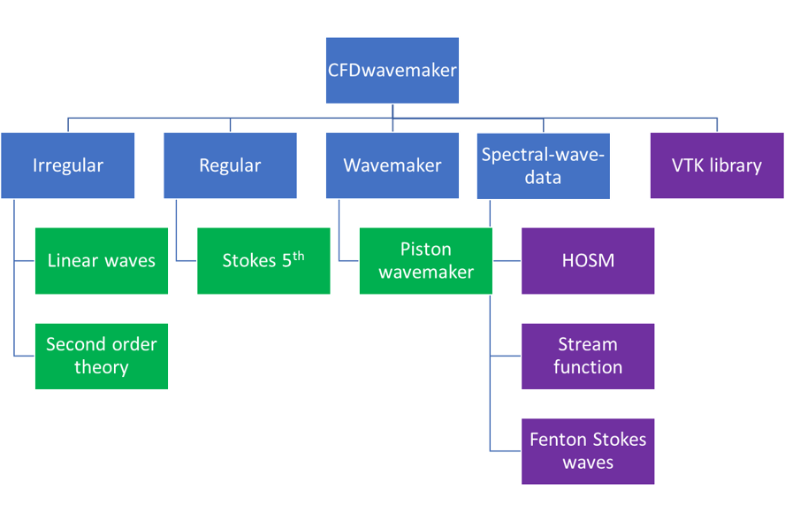

Wave theories
=============

CFDwavemaker provided a range of different wave theories which may be used to waves in a numerical environment. Some are implemented as part of the code, while others are indirectly provided through the support of the swd file format which may read simulation files from codes (ex: Higher order spectral methods). An overview of the different theories and how they are organized in the library is given in :numref:`theory_overview`

.. _theory_overview:

   
   Overview of theories implemented (or to be implemented) in CFDwavemaker

Irregular wave theory
-----------------------

Linear potential wave theory
............................

Linear wave theory, also known as Airy waves has been widely used for more than 50 years for describing irregular waves.
Documentation of this theory exists in a number of places and therefore this will not be further adressed here.
Reference is made to `Wikipedia`_ for a nice overview of this theory. Other sources are :cite:`DNVGLRPC205,faltinsen1993sea`  

.. _`Wikipedia`: https://en.wikipedia.org/wiki/Airy_wave_theory

Second order potential wave theory 
..................................

Second order wave theory
Reference is made to the the classic article from Sharma and Dean 1981 ,Ref. :cite:`sharma1981second`. The current implementation is based on the implementation given by Johannessen 1997 (Ref. :cite:`johannessen1997effect`).

Regular wave theory
-------------------

Stokes 5th order wave
.....................

The stokes 5th order wave is a classic. The current implementation is based on Skjelbreia and Hendricksons implementation ,Ref. :cite:`skjelbreia1960fifth`. Fenton also had a nice implementation of this type of wave.

Wave maker theory
-----------------

Wave maker theory is generally useful, especially if you want to replicate something which has been generated in a tank. 

Piston wavemaker theory
.......................

Reference is made to the Kennard1949 (Ref. :cite:`kennard1949generation`). The input is time series of horizontal paddle movement.

